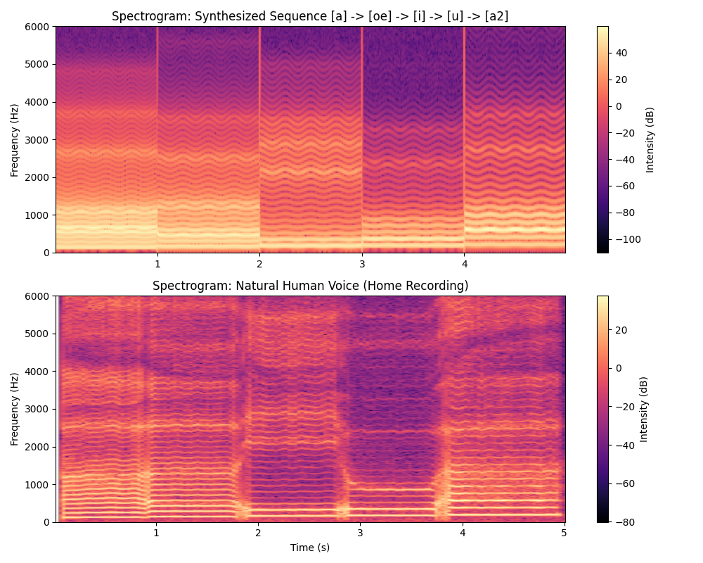

# 🎙️ DT2212 Music Acoustics

Coursework and technical reports for the DT2212 Music Acoustics course at KTH. These assignments focus on the programmatic analysis, modeling, and synthesis of acoustic instruments and the human voice.

**Tools Used:** `Python` | `NumPy` | `SciPy` | `Matplotlib` | `pydub`

---

### 1. Modal Synthesis of a Glockenspiel
This assignment explores whether a complex percussion instrument can be realistically reconstructed using purely additive synthesis. 

* **The Process:** Performed FFT spectral analysis on a raw Glockenspiel recording to identify modal frequencies and calculate their exponential decay envelopes.
* **The Result:** Reconstructed the instrument from scratch and mapped the decaying sinusoids to generate a synthetic melody using Equal Temperament pitch shifting.

▶️ **[Listen to the Synthesized Melody](./synthesis-outputs/synthesised_melody.wav)**

📄 **[Read the Full Technical Report (PDF)](Modal-Synthesis/DT2212-Modal-Synthesis-Report.pdf)**

---

### 2. Voice Synthesis (Source-Filter Method)
This assignment constructs a digital model of the human vocal tract to create a singing synthesizer. 

* **The Process:** Generated an idealized glottal source (with natural vibrato) and processed it through five cascaded two-pole resonators acting as formant filters to shape specific vowels.
* **The Result:** Synthesized a dynamic vocal sequence (`[a] -> [oe] -> [i] -> [u] -> [a2]`) and evaluated it against a real human voice.

📄 **[Read the Full Technical Report (PDF)](Voice-Synthesis/DT2212-Voice-Synthesis-Report.pdf)**

---

### 💻 How to Run the Synthesis Scripts
Ensure you have the required libraries installed: `pip install numpy scipy matplotlib pydub simpleaudio`.

1. Clone the repository to your local machine.
2. Navigate into the specific assignment folder (e.g., `cd Modal-Synthesis`). 
3. Run the script directly (e.g., `python modalsynthesis.py`).

*Note: The wav file writing is currently commented out in the script. Also, run the scripts from within their specific assignment folders so the relative file paths to the baseline `.wav` files execute correctly.*